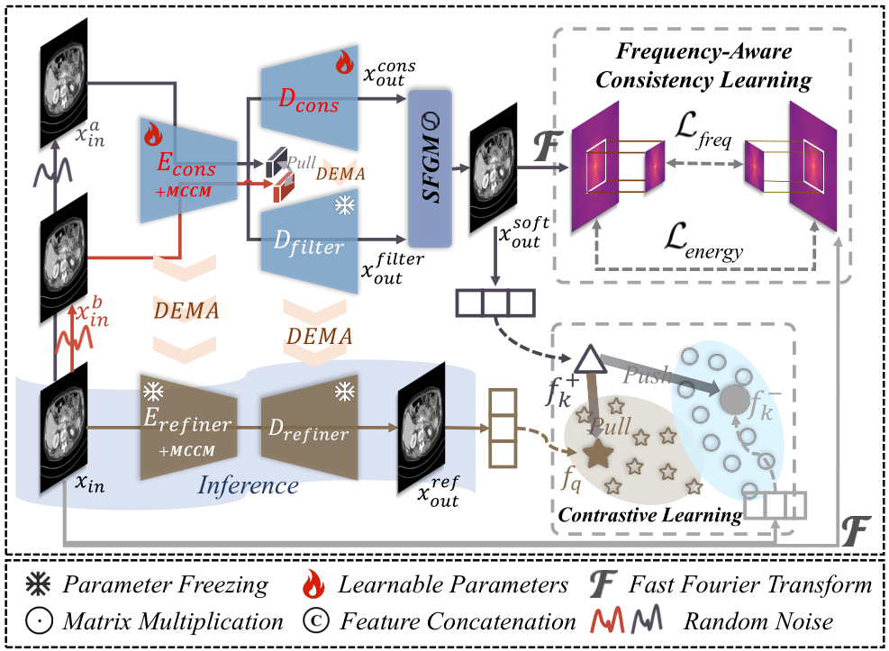
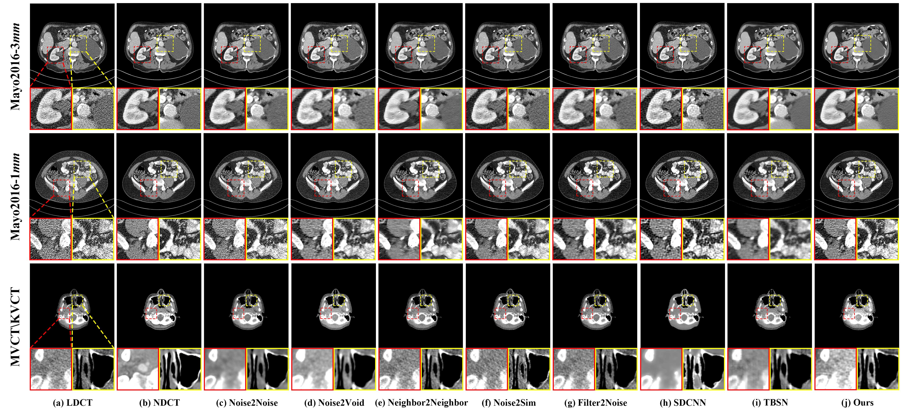

 
    

    <h1 style = "font-size: 80px;"> Noise2Freq </h1>
    
        <b>Revisiting the Noise Independence Assumption: A Frequency-Consistent Self-
Supervised Framework for LDCT Denoising<b>		
    

    

    

# 1. Data Download and Preprocessing

1. Public datasets are available at the following links.

   * **Mayo2016**: [Low Dose CT Grand Challenge](https://www.aapm.org/grandchallenge/lowdosect/)
   * **Mayo2020**:[LDCT-AND-PROJECTION-DATA - The Cancer Imaging Archive (TCIA)](https://www.cancerimagingarchive.net/collection/ldct-and-projection-data/)
2. The downloaded data is stored in the following format.
3. Run script `dataset/mayo2016_process_code.py` or script `dataset/mayo2020_process_code.py`  for preprocessing of respective datasets.

   * Remember to modify the corresponding names and paths in the script.
4. After preprocessing, modify the path in `dataset/get_dataset_info.py` to the absolute path of your processed dataset directory.

# 2. Inference

1. You can modify `reference_version` on line `32` of `inference.py` to select different datasets and models trained under different training settings for inference.1. Modify the second element, `[dataset_name]`, of `reference_version` to select the dataset for testing.
   2. Modify the third element, `[model_mode]`, of `reference_version` to select a model trained under a different training mode.

   1. `ldct`: Reproducing the results of training with `ldct only`.
   2. `ndct`: Reproducing the results of training with `ndct only`.

   ---
2. Run the $inference.py$ file and the results will be stored in the `inference` folder.

# 3. Pre-training Weight

Pre-training weights are stored in the `\best_ckpt` folder.
